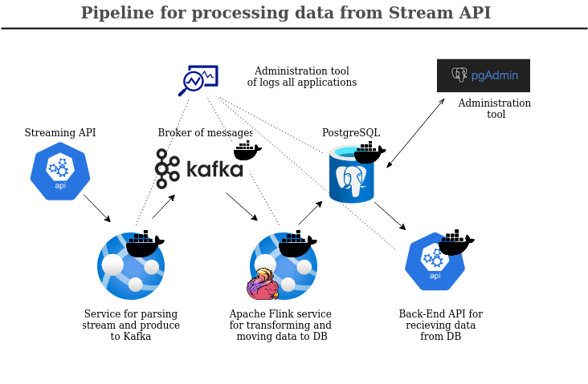
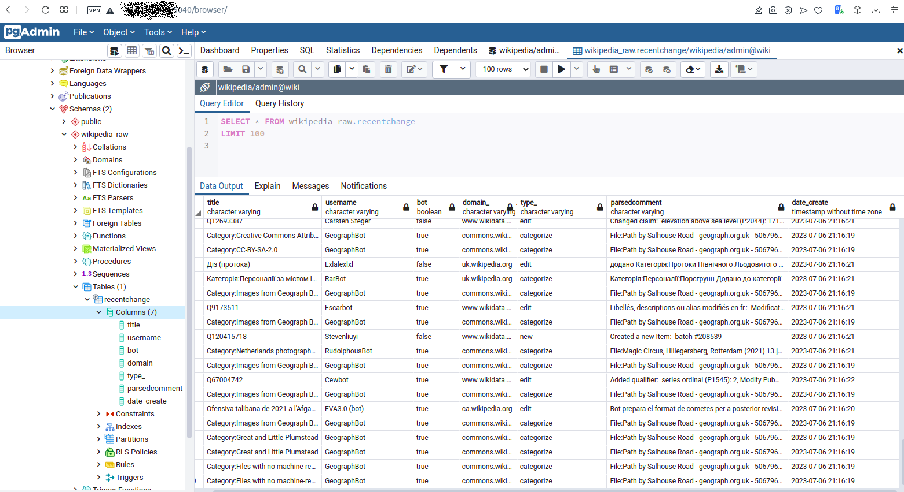

Data pipeline with using as source - streaming API provided by Wikipedia. The further points in pipeline will be Kafka, Apache Flink framework and PostgreSQL.
## Test case of developing pipeline from streaming API to DataBase by using Flink
-----------------------------------------------------------------------------------------------------
### Task definition:

Build a data pipeline in Python that extracts and transforms the wikipedia (mediawiki.recentchange events) 
https://stream.wikimedia.org/?doc#/streams/get_v2_stream_recentchange. These data should be transformed into a table that are representative of a relational database.

<h3>As the source of data samples I will get the data from https://stream.wikimedia.org/v2/stream/recentchange </h3>

--------------------------------------------------------------------

### Task realization:

#### 1. Assumptions:

- On entry point data will be a little processed and published to Kafka as main item of sustainability in that pipeline<br>
- As main tool for parsing data and transformation to necessary instance I'll be use the Python library pyFlink (https://flink.apache.org/2020/04/09/pyflink-introducing-python-support-for-udfs-in-flinks-table-api/#python-support-for-udfs-in-flink-110) which can work with Kafka and using UDF procedures for processing data in Python<br>
- As main tool for storing data I'll use PostgreSQL with administration service pgAdmin<br>
- In that example I'll  process raw layer of data and store clean data to DB. Raw layer should be uploaded at separate storage (hdfs, s3 or etc) but this is not included here - just preparation for this by using Kafka, which can store data in the queue.<br>

<h2 align="center"> Architecture<br>
  
</h2>

-------------------------------------------------------------------------------------

#### 2. Structure of data transformation

- We have next attributes within raw data : "id", "type", "namespace", "title", "title_url","comment","timestamp","user","bot","notify_url","server_url","server_name","server_script_path","wiki","parsedcomment"<br>
- For simplifying I will use next fields: 'title', 'user', 'timestamp', 'domain', 'bot', 'parsedcomment', 'type'. I will implement the transformation of field 'timestamp' - from unix time to datetime and field 'parsedcomment' - cleansing from HTML tags by using python library BS4 (https://beautiful-soup-4.readthedocs.io/en/latest/).

<h2 align="center"> ERD<br>

  
</h2>

---------------------------------------------------------------------------------------------
#### 3. Prerequisites

-  Docker install (https://www.docker.com)
-  Preferable OS is Linux
-  Python install (https://www.python.org), ver 3.8
-  Provisioning : RAM from 8 Gb, CPU from 2, HDD from 20 Gb

Please, install python libraries which require at this project

```bash
_node: ~/work/wikipedia_data_pipeline$ pip install -r requirements.txt
```
========================================================================================================================

#### 4. Deploying main tools for storing data

First of all, please save file .env from .env.example also in root directory of project and define critical variables - credentials and paths

#### Building Kafka broker 

I need to define configs in .env file according to Kafka variables : hosts, ports and directories for mount to Kafka instance - data and properties
examples in .env.example. <br>
Next variables: KAFKA__HOST,  KAFKA__DATA (/var/kafka_logs), KAFKA__CONFIGS (/var/kafka_configs)

```bash
_node: ~/work/wikipedia_data_pipeline$ mkdir /var/kafka_logs
_node: ~/work/wikipedia_data_pipeline$ mkdir /var/kafka_configs
```

after that you can run next command

```bash
_node: ~/work/wikipedia_data_pipeline$ docker-compose -f app__kafka_broker/docker-compose.yml up --build -d
```

for simple checking you can see the directory /var/kafka_logs - the existance of files according your topic which will be created during building

```bash
_node: ~/work/wikipedia_data_pipeline$ ls /var/kafka_logs
```
or you can see logs of building docker container

```bash
_node: ~/work/wikipedia_data_pipeline$ docker logs <container_id>
```
----------------------------------------------------------------------------------------
#### Building PostgreSQL and pgAdmin

you should define configs in env file according to PostgreSQL and PGAdmin credentials : hosts, ports and directories for mount to DB and Admin instances - data and properties
examples in .env.example


```bash
_node: ~/work/wikipedia_data_pipeline$ mkdir /var/pgdata
_node: ~/work/wikipedia_data_pipeline$ mkdir /var/pglogs
_node: ~/work/wikipedia_data_pipeline$ mkdir /var/pgadmin_logs
```
after that you can run next command

```bash
_node: ~/work/wikipedia_data_pipeline$ docker-compose -f app__db_postgresql/docker-compose.yml up --build -d
```
for simple checking you can visit through internet browser the page: http://<PG_ADMIN_HOST>:5040/browser/  and see the starting pgAdmin tool
If you are in pgAdmin - just define database instance once and you can see your DB with next structure.
During building instance of PostgreSQL there was initialized the bash script (app__db_postgresql/init_conf.sh) which installed all necessary tables and relations

--------------------------------------------------------------------------------------------------------------------
#### 5. Deploying components : source of data, intermediate and final processing

#### Stage of processing data from Kafka, transforming and insert to database

Apache Flink is a popular real-time data processing framework. It’s gaining more and more popularity thanks to its low-latency processing at extremely high throughputs in a fault-tolerant manner.

This module realized by using pyFlink library which can work with Kafka and processing stream from Kafka and by using sink or other connector store data to PostgreSQL.

In this example I'll use python library pyFlink and jar files as additional drivers for connecting to Kafka and PostgreSQL (in the directory - app__flink_kafka_to_db/jarlibs).

The consumer built on Docker container which will initialize environment for Flink and will use the scripts for defining format of the data source, transformation data, format of target table (in the directory - app__flink_kafka_to_db/scripts).

For running this instance use next command

```bash
_node: ~/work/wikipedia_data_pipeline$ docker-compose -f app__flink_kafka_to_db/docker-compose.yml up --build -d
```

-----------------------------------------------------------------------------------------------------

#### Stage of processing data from streaming API and publishing to Kafka

This is a simple application which try to get streaming API and parsing data from input json and without processing publish it to Kafka using connector on Python.

It's also part of my assumption, because I can use here some preprocessing or validation of data, but this is for future releases.

For running it just use next command

```bash
_node: ~/work/wikipedia_data_pipeline$ python app__streaming_api_to_kafka
```

--------------------------------------------------------------------------------------------------------------

You can go to pgAdmin for checking data in DB and see next picture


<h3 align="center"> wikipedia_raw.recentchange<br>

  
</h3>

==================================================================================================

This is one of many realisation that data pipeline